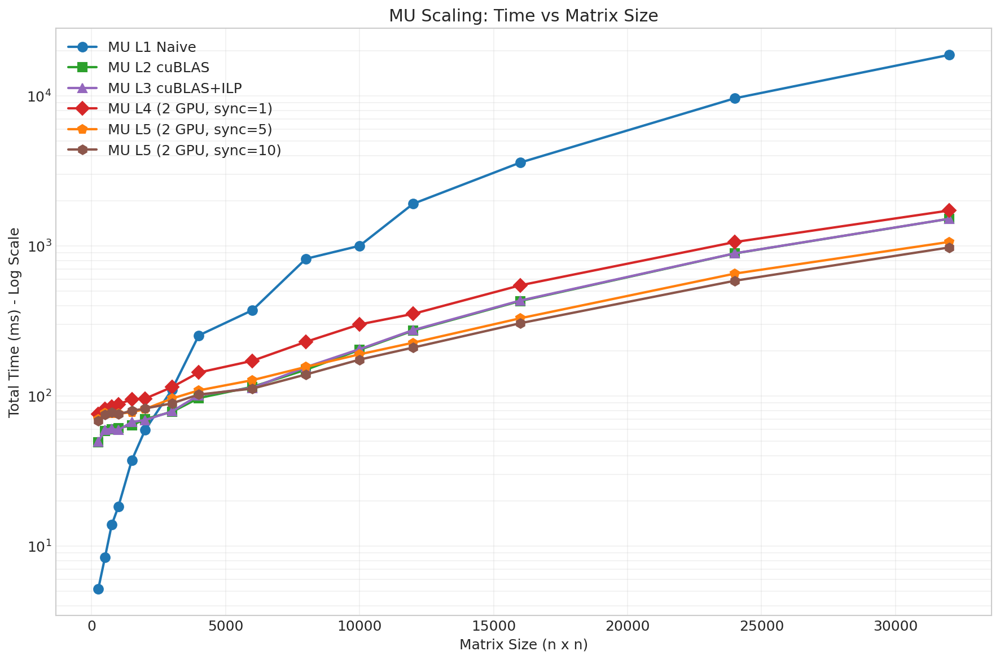
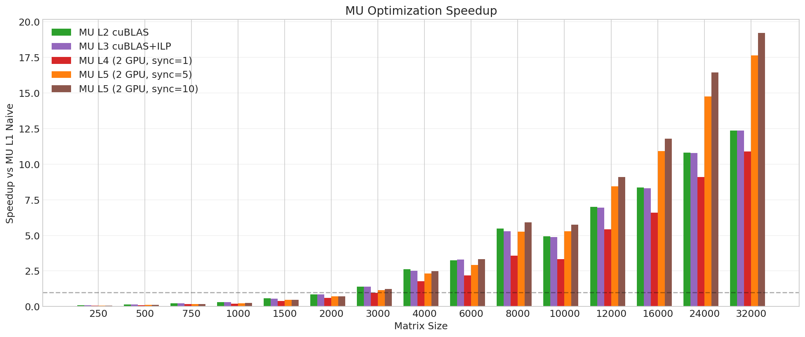
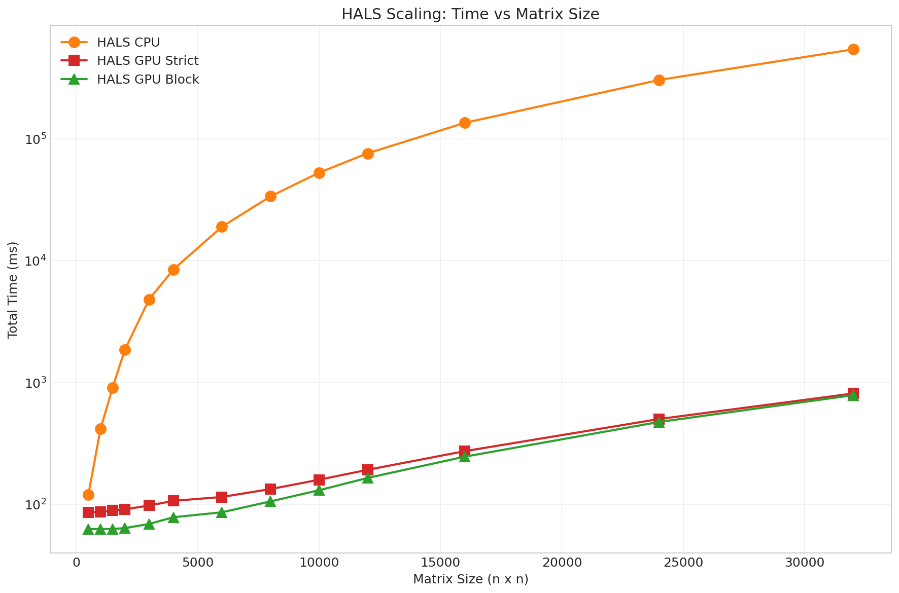
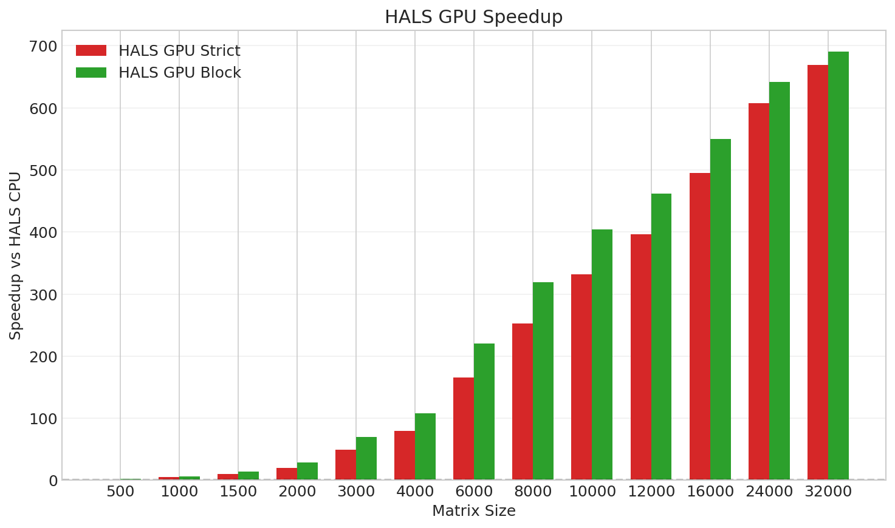
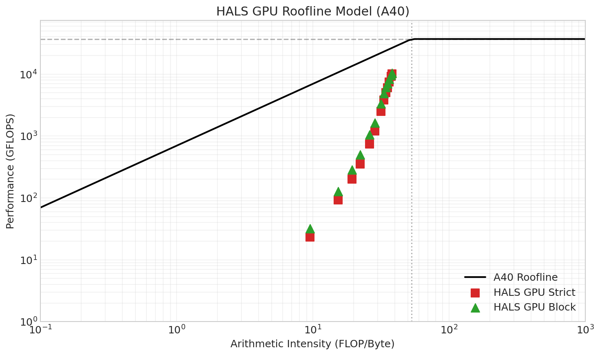

# GPU Parallelization of Non-negative Matrix Factorization: From Multiplicative Updates to Hierarchical ALS

**CSE 587: Parallel Computing**

---

## Abstract

We explore GPU parallelization strategies for Non-negative Matrix Factorization (NMF) through two distinct algorithms. We first implement the Multiplicative Update (MU) algorithm from scratch to understand the computational patterns, progressively optimizing it from naive GPU kernels to cuBLAS-accelerated implementations achieving 12x speedup. After exploring multi-GPU parallelization (which revealed PCIe bottleneck limitations), we tackle the more challenging Hierarchical Alternating Least Squares (HALS) algorithm. Unlike MU where updates are independent, HALS exhibits strong sequential dependencies due to its Gauss-Seidel update scheme—each column must wait for all previous columns to complete. We develop two parallelization strategies: a strict approach preserving exact convergence properties, and a novel block-parallel approach with random shuffling that trades slight convergence degradation for significant speedup. Our HALS GPU implementation achieves up to 669x speedup over CPU, demonstrating that even inherently sequential algorithms can be effectively parallelized with careful algorithm-hardware co-design.

---

## 1. Introduction

### 1.1 What is Non-negative Matrix Factorization?

Non-negative Matrix Factorization (NMF) is a dimensionality reduction technique that decomposes a non-negative matrix X into two non-negative factor matrices:

```
X ≈ W × H

where:
    X is m × n (input data matrix, all elements ≥ 0)
    W is m × k (basis matrix)
    H is k × n (coefficient matrix)
    k << min(m, n) (low-rank approximation)
```

The non-negativity constraint distinguishes NMF from other factorizations like SVD. This constraint is natural for many real-world data: pixel intensities in images, word counts in documents, and user ratings in recommender systems cannot be negative. The resulting factors W and H often have intuitive interpretations—columns of W represent "parts" or "features," and rows of H represent how much each feature contributes to each data point.

### 1.2 Two Approaches to Solving NMF

There are two major algorithmic approaches to computing NMF, each with distinct computational characteristics:

**Approach 1: Multiplicative Update (MU)**

The MU algorithm, introduced by Lee and Seung, updates all elements of W and H simultaneously using multiplicative factors derived from the current approximation error. The key insight is that the update rules are designed such that if we start with non-negative matrices, they remain non-negative throughout—no explicit projection step is needed.

**Approach 2: Hierarchical Alternating Least Squares (HALS)**

HALS takes a fundamentally different approach. Instead of updating all elements at once, it updates one column (or row) at a time, solving a simple least squares problem for each. This sequential processing allows each update to immediately use the results of previous updates—a technique known as Gauss-Seidel iteration in numerical analysis. The benefit is faster convergence; the cost is reduced parallelism.

### 1.3 Our Journey and Contributions

Our project followed a natural progression:

1. **First, we implemented MU from scratch** to understand the algorithm's structure and computational patterns. This gave us a baseline to optimize against and helped us identify the key operations (matrix multiplications, element-wise operations).

2. **We progressively optimized MU**, moving from naive CUDA kernels to cuBLAS-accelerated code, and explored multi-GPU parallelization. This phase taught us about GPU performance characteristics and the limitations of naive parallelization approaches.

3. **We then tackled the harder problem: HALS.** Having understood GPU optimization through MU, we were better prepared to address HALS's fundamental challenge—its sequential dependencies. This is where the non-trivial parallelization work lies.

4. **We developed two HALS parallelization strategies**, analyzing their trade-offs between convergence quality and execution speed.

---

## 2. Multiplicative Update: Our First Implementation

### 2.1 Understanding the MU Algorithm

The MU algorithm updates W and H iteratively using the following rules:

```
Repeat until convergence:
    # Update H (coefficient matrix)
    H = H * (W^T × X) / (W^T × W × H + ε)

    # Update W (basis matrix)
    W = W * (X × H^T) / (W × H × H^T + ε)

where:
    * denotes element-wise multiplication
    / denotes element-wise division
    ε is a small constant (10^-10) to prevent division by zero
```

Each iteration involves several matrix multiplications and element-wise operations. Looking at the H update:
- `W^T × W` produces a k×k matrix (compute once per iteration)
- `W^T × X` produces a k×n matrix
- `(W^T × W) × H` produces a k×n matrix
- Element-wise operations on k×n matrices

The key observation is that **all elements of H can be updated independently**—the formula for H[i,j] depends only on the *old* values of W and H, not on other elements being updated in the same iteration. The same applies to W. This independence is what makes MU amenable to parallelization.

### 2.2 Level 1: Naive GPU Implementation

We started by implementing everything from scratch to understand the computational patterns:

```cuda
// Our custom naive GEMM kernel (16×16 tiles)
__global__ void naive_gemm(float* A, float* B, float* C, int M, int N, int K) {
    // Allocate shared memory for tiles
    __shared__ float As[16][16];
    __shared__ float Bs[16][16];

    int row = blockIdx.y * 16 + threadIdx.y;
    int col = blockIdx.x * 16 + threadIdx.x;

    float sum = 0.0f;

    // Iterate over tiles
    for (int t = 0; t < (K + 15) / 16; t++) {
        // Collaborative loading into shared memory
        if (row < M && t*16 + threadIdx.x < K)
            As[threadIdx.y][threadIdx.x] = A[row * K + t*16 + threadIdx.x];
        else
            As[threadIdx.y][threadIdx.x] = 0.0f;

        if (t*16 + threadIdx.y < K && col < N)
            Bs[threadIdx.y][threadIdx.x] = B[(t*16 + threadIdx.y) * N + col];
        else
            Bs[threadIdx.y][threadIdx.x] = 0.0f;

        __syncthreads();

        // Compute partial product
        for (int k = 0; k < 16; k++)
            sum += As[threadIdx.y][k] * Bs[k][threadIdx.x];

        __syncthreads();
    }

    if (row < M && col < N)
        C[row * N + col] = sum;
}

// Fused element-wise kernel: H = H * numerator / (denominator + eps)
__global__ void elementwise_update(float* H, float* num, float* denom, int size, float eps) {
    int idx = blockIdx.x * blockDim.x + threadIdx.x;
    if (idx < size) {
        H[idx] = H[idx] * num[idx] / (denom[idx] + eps);
    }
}
```

This implementation taught us several things:
- Matrix multiplication dominates the computation time
- Shared memory tiling reduces global memory accesses
- The 16×16 tile size was chosen to match warp size and shared memory constraints

### 2.3 Level 2: Leveraging cuBLAS

While our naive implementation worked, we knew that NVIDIA's cuBLAS library represents decades of optimization work. Replacing our naive GEMM with cuBLAS calls showed the impact of optimized libraries:

```cuda
// Level 2: Replace naive GEMM with cuBLAS
cublasHandle_t handle;
cublasCreate(&handle);

// WtW = W^T × W
cublasSgemm(handle, CUBLAS_OP_T, CUBLAS_OP_N,
            k, k, m,              // dimensions
            &alpha, d_W, m,       // W is m×k, stored column-major
            d_W, m,
            &beta, d_WtW, k);

// WtX = W^T × X
cublasSgemm(handle, CUBLAS_OP_T, CUBLAS_OP_N,
            k, n, m,
            &alpha, d_W, m, d_X, m,
            &beta, d_WtX, k);

// temp_H = WtW × H
cublasSgemm(handle, CUBLAS_OP_N, CUBLAS_OP_N,
            k, n, k,
            &alpha, d_WtW, k, d_H, k,
            &beta, d_temp_H, k);

// Fused element-wise update
elementwise_update<<<grid, block>>>(d_H, d_WtX, d_temp_H, k*n, 1e-10f);
```

**Why is cuBLAS so much faster?**

cuBLAS incorporates optimizations that are extremely difficult to implement correctly:
- **Optimal tile sizes**: Tuned per GPU architecture, often using 64×64 or 128×128 tiles with register blocking
- **Tensor cores**: On modern GPUs, cuBLAS automatically uses tensor cores for mixed-precision acceleration
- **Memory access patterns**: Sophisticated prefetching and cache utilization strategies
- **Instruction scheduling**: Hand-tuned assembly for maximum instruction-level parallelism

**Interesting finding**: At small matrix sizes (under 2000×2000), our naive GEMM was actually *faster* than cuBLAS! This is because cuBLAS has significant setup overhead (library initialization, kernel selection, parameter validation) that dominates when the actual computation is small. The crossover point where cuBLAS becomes beneficial is around 3000×3000 matrices.

### 2.4 Level 3: Instruction-Level Parallelism in Element-wise Operations

With cuBLAS handling matrix multiplications efficiently, we looked at the remaining bottleneck: element-wise operations. Our initial kernel processed one element per thread, which exposes memory latency:

```cuda
// Level 2: Simple element-wise (1 element per thread)
__global__ void elementwise_simple(float* H, float* num, float* denom, int size, float eps) {
    int idx = blockIdx.x * blockDim.x + threadIdx.x;
    if (idx < size) {
        // Memory load → compute → store
        // Thread waits for memory during load
        H[idx] = H[idx] * num[idx] / (denom[idx] + eps);
    }
}

// Level 3: ILP optimization (8 elements per thread)
__global__ void elementwise_ilp8(float* H, float* num, float* denom, int size, float eps) {
    int base = (blockIdx.x * blockDim.x + threadIdx.x) * 8;

    if (base + 7 < size) {
        // Issue all loads at once (memory requests can overlap)
        float h0 = H[base+0], h1 = H[base+1], h2 = H[base+2], h3 = H[base+3];
        float h4 = H[base+4], h5 = H[base+5], h6 = H[base+6], h7 = H[base+7];

        float n0 = num[base+0], n1 = num[base+1], n2 = num[base+2], n3 = num[base+3];
        float n4 = num[base+4], n5 = num[base+5], n6 = num[base+6], n7 = num[base+7];

        float d0 = denom[base+0], d1 = denom[base+1], d2 = denom[base+2], d3 = denom[base+3];
        float d4 = denom[base+4], d5 = denom[base+5], d6 = denom[base+6], d7 = denom[base+7];

        // Compute while other loads complete
        h0 = h0 * n0 / (d0 + eps);
        h1 = h1 * n1 / (d1 + eps);
        // ... repeat for h2-h7

        // Store results
        H[base+0] = h0; H[base+1] = h1; // ...
    }
}
```

The idea is that by having each thread handle multiple elements, we can issue multiple memory load requests that execute concurrently. While the GPU waits for one load, others are in flight. The compute operations then overlap with remaining loads.

**Result**: This optimization provided only 1.0-1.1x improvement. The reason is that element-wise operations represent a tiny fraction of total execution time—cuBLAS GEMM dominates. At large matrix sizes, GEMM takes 95%+ of the time, so optimizing the remaining 5% has limited impact.

### 2.5 Levels 4-5: Multi-GPU Exploration (What Didn't Work)

With single-GPU optimization reaching diminishing returns, we explored multi-GPU parallelization. The natural approach for NMF is to distribute the H matrix columns across GPUs:

```
Data Distribution:
GPU 0: H[:, 0:n/2]      (first half of columns)
GPU 1: H[:, n/2:n]      (second half of columns)

Both GPUs have full copies of W and X
```

The challenge is the W update, which requires computing `H × H^T`. Each GPU has only partial H, so we need to combine their contributions:

```
// Level 4: Multi-GPU with synchronization every iteration
for iter = 1 to max_iter:

    // Phase 1: Update H (embarrassingly parallel)
    parallel on each GPU g:
        H_local = H[:, start[g]:end[g]]
        // Update H_local using local copy of W

    // Phase 2: Compute HH^T contributions
    parallel on each GPU g:
        HHt_local[g] = H_local × H_local^T   // k×k matrix

    // Phase 3: AllReduce (the bottleneck!)
    // Need to sum HHt contributions from all GPUs
    for each GPU g:
        cudaMemcpy(host_HHt[g], device_HHt[g], ...)  // D2H

    host_HHt_global = host_HHt[0] + host_HHt[1]      // CPU add

    for each GPU g:
        cudaMemcpy(device_HHt[g], host_HHt_global, ...)  // H2D

    // Phase 4: Update W using global HHt
    parallel on each GPU g:
        // Update W using HHt_global
```

**The problem**: We verified with `nvidia-smi topo -m` that our A40 GPUs connect via PCIe, not NVLink. The topology showed "NODE" connections, meaning data must travel through the CPU:

```
GPU0 ←→ PCIe ←→ CPU ←→ PCIe ←→ GPU1
          ~32 GB/s each direction
```

Each AllReduce operation requires:
1. Device-to-Host copy: ~5-10μs latency + bandwidth-limited transfer
2. CPU computation: Fast but adds synchronization
3. Host-to-Device copy: ~5-10μs latency + bandwidth-limited transfer

For our k=20 rank, HHt is only 20×20×4 = 1.6KB—the latency dominates!

**Result**: 2 GPUs were *slower* than 1 GPU at all matrix sizes we tested.

We tried Level 5 with reduced synchronization (sync every 5-10 iterations instead of every iteration), but this only marginally helped and introduced convergence concerns.

**Lesson learned**: Multi-GPU parallelization is not automatically beneficial. Without proper high-bandwidth interconnects like NVLink, communication overhead can exceed any computational savings.

---

## 3. HALS: The Challenging Parallelization Problem

Having optimized MU and encountered the limits of naive multi-GPU approaches, we turned to a fundamentally harder problem: parallelizing an algorithm with inherent sequential dependencies.

### 3.1 Understanding the HALS Algorithm

HALS updates the factor matrices one column (or row) at a time, solving a simple non-negative least squares problem for each:

```
HALS Algorithm:
for iter = 1 to max_iterations:

    # Update each column of W
    for f = 0 to k-1:
        # Compute the residual not explained by other columns
        residual_f = X - sum(W[:,j] × H[j,:] for j ≠ f)

        # Update column f to best explain this residual
        W[:,f] = max(0, residual_f × H[f,:]^T / ||H[f,:]||²)

        # Normalize the column
        W[:,f] = W[:,f] / ||W[:,f]||

    # Similarly update each row of H
    for f = 0 to k-1:
        # ... similar update for H[f,:]
```

The key insight is in "residual not explained by other columns." When computing the update for column f, we subtract the contributions of ALL other columns, including columns 0 through f-1 that have *already been updated in this iteration*.

Let's trace through an example with k=3 columns:

```
Iteration start: W has columns [W0_old, W1_old, W2_old]

Update f=0:
    residual_0 = X - W1_old×H[1,:] - W2_old×H[2,:]
    W[:,0] = new value → W becomes [W0_new, W1_old, W2_old]

Update f=1:
    residual_1 = X - W0_new×H[0,:] - W2_old×H[2,:]
                     ↑ Uses the UPDATED W0!
    W[:,1] = new value → W becomes [W0_new, W1_new, W2_old]

Update f=2:
    residual_2 = X - W0_new×H[0,:] - W1_new×H[1,:]
                     ↑ Uses UPDATED W0 and W1!
    W[:,2] = new value → W becomes [W0_new, W1_new, W2_new]
```

This is the Gauss-Seidel iteration pattern: each update immediately uses the most recent values available. The benefit is faster convergence—new information propagates within the same iteration. In our experiments, HALS converges in 50 iterations where MU requires 100-200 for similar reconstruction error.

### 3.2 Why This is Hard to Parallelize

The sequential dependency is fundamental to HALS's fast convergence:

```
Column f update DEPENDS ON columns 0, 1, ..., f-1 being complete

Timeline with k=4:
    Time →
    [Update col 0]
                  [Update col 1]
                                [Update col 2]
                                              [Update col 3]

We CANNOT do this:
    [Update col 0]
    [Update col 1]  ← Would use STALE col 0 values!
    [Update col 2]  ← Would use STALE col 0 and 1!
    [Update col 3]
```

If we update all columns in parallel (the natural GPU approach), we lose the Gauss-Seidel property—each column would use only *old* values, reverting to Jacobi iteration. This is mathematically equivalent to MU and loses HALS's convergence advantage.

### 3.3 Our Thought Process

Faced with this challenge, we considered several strategies:

1. **Abandon HALS for MU?** No—we wanted to tackle the hard parallelization problem.

2. **Accept sequential column updates but parallelize within each column?** This became our "strict" approach.

3. **Can we update some columns in parallel without completely breaking convergence?** This led to our "block-parallel" approach.

4. **What if we randomize the update order?** This insight turned out to be crucial.

### 3.4 HALS Level 1: Strict Parallel Approach

Our first GPU implementation preserves the exact Gauss-Seidel update order:

```
Strict Parallel HALS:
for iter = 1 to max_iterations:

    # Pre-compute matrices using cuBLAS (efficient)
    HHt = H × H^T      # k×k matrix
    XHt = X × H^T      # m×k matrix

    # Sequential loop over columns
    for f = 0 to k-1:

        # PARALLEL: Update all m rows of column f simultaneously
        launch_kernel<<<ceil(m/256), 256>>>:
            for each row in parallel:
                numerator = XHt[row, f]

                # Compute interaction with OTHER columns
                # This reads W[:,0:k] which includes already-updated columns 0..f-1
                interaction = 0
                for j = 0 to k-1:
                    if j != f:
                        interaction += W[row, j] * HHt[j, f]

                # Update
                W[row, f] = max(0, (numerator - interaction) / HHt[f, f])

        cudaDeviceSynchronize()  # Must complete before next column!

        # PARALLEL: Normalize column f
        launch_kernel<<<...>>>:
            compute ||W[:,f]||
            W[:,f] /= ||W[:,f]||

        cudaDeviceSynchronize()

    # Similar for H updates...
```

**Memory access pattern analysis**:

We store matrices in column-major order (Fortran style), which is standard for numerical libraries. This means consecutive elements of a column are contiguous in memory:

```
Column-major layout for m×k matrix W:
Memory: [W[0,0], W[1,0], W[2,0], ..., W[m-1,0], W[0,1], W[1,1], ...]
         ↑_____________column 0_______________↑  ↑___column 1___

When threads access W[:,f]:
Thread 0 → W[0,f]
Thread 1 → W[1,f]  → Adjacent memory locations!
Thread 2 → W[2,f]
```

Adjacent threads access adjacent memory locations—this is **coalesced access**, the optimal pattern for GPU memory. A single memory transaction can serve an entire warp.

**Performance characteristics**:
- m threads update in parallel (thousands to millions)
- k×2 kernel launches per iteration (k updates + k normalizations)
- Kernel launch overhead: ~5-10μs each
- For k=20: 40 launches × 10μs = 400μs overhead per iteration

**Result**: Preserves exact Gauss-Seidel convergence. Final error matches CPU implementation.

### 3.5 HALS Level 2: Block-Parallel with Randomization

The strict approach leaves parallelism on the table. With k=20 columns, we launch 40 small kernels per iteration. Can we do better?

**Key insight**: We don't need *perfect* Gauss-Seidel ordering. If we update a few columns in parallel, each using slightly stale values for the others, the algorithm might still converge—just not as quickly per iteration.

**First attempt (failed)**: Update all k columns in parallel.
```
for iter = 1 to max_iterations:
    parallel for f = 0 to k-1:
        update W[:,f]    # All use old values of each other
```
This completely loses Gauss-Seidel benefits. Convergence was much slower—no better than MU.

**Second attempt (failed)**: Update in blocks of 5 without shuffling.
```
for block = 0 to k/5 - 1:
    parallel for f in [block*5 : (block+1)*5]:
        update W[:,f]
    synchronize
```
Convergence degraded significantly! The problem: columns 0-4 always update together, always using stale values from each other. This systematic pattern caused errors to accumulate over iterations.

**Key insight that worked**: Random shuffling breaks systematic error patterns.

```
Block-Parallel HALS with Shuffling:

block_size = 5
num_blocks = k / block_size
streams[5]  # CUDA streams for parallel execution

for iter = 1 to max_iterations:

    # Pre-compute HHt, XHt with cuBLAS
    ...

    for block = 0 to num_blocks - 1:

        # CRUCIAL: Shuffle column order within this block
        cols_in_block = [block*5, block*5+1, ..., block*5+4]
        random_shuffle(cols_in_block)

        # Update block_size columns in parallel using streams
        for i = 0 to block_size - 1:
            f = cols_in_block[i]
            stream_id = i

            # Async kernel launch in stream
            launch_kernel<<<grid, block, 0, streams[stream_id]>>>:
                update W[:, f]

            launch_kernel<<<..., streams[stream_id]>>>:
                normalize W[:, f]

        # Barrier: wait for all streams before next block
        for i = 0 to block_size - 1:
            cudaStreamSynchronize(streams[i])

    # Similar for H updates...
```

**Why randomization works**:

Consider columns 0 and 1 that often update in the same block:
- Without shuffling: Column 0 *always* uses stale column 1 values, and vice versa. The same systematic error repeats every iteration.
- With shuffling: Sometimes column 0 updates first (getting fresh column 1 values), sometimes column 1 updates first. Over many iterations, the errors average out.

Think of it like this: Gauss-Seidel requires a consistent ordering to guarantee convergence. When we parallelize a block, we're temporarily breaking that ordering. Randomization ensures we're not consistently breaking it the same way, preventing error accumulation.

**Choosing block size**:

We experimented with different block sizes:

| Block Size | Parallelism | Convergence Quality | Our Choice |
|------------|-------------|---------------------|------------|
| 1 | None (strict) | Perfect | No—defeats purpose |
| 3 | Low | Good | No—not enough speedup |
| 5 | Moderate | Acceptable | **Yes** |
| 10 | High | Degraded | No—too much error |
| k (all) | Maximum | Poor | No—reverts to Jacobi |

Block size 5 emerged as a sweet spot—enough parallelism to utilize streams effectively, but not so much that convergence suffers.

### 3.6 Correctness Verification

An important aspect of the project is verifying that our GPU implementations produce correct results. We compare the final reconstruction error (||X - WH||_F / ||X||_F) between implementations:

| Matrix Size | CPU Error | GPU Strict Error | GPU Block Error |
|-------------|-----------|------------------|-----------------|
| 500×500 | 0.0346 | 0.0346 | 0.0297 |
| 1000×1000 | 0.0370 | 0.0352 | 0.0314 |
| 4000×4000 | 0.0429 | 0.0417 | 0.1202 |
| 8000×8000 | 0.0445 | 0.0451 | 0.1147 |
| 16000×16000 | 0.0459 | 0.0407 | 0.0812 |
| 32000×32000 | 0.0467 | 0.0400 | 0.0982 |

**Observations**:
- **GPU Strict** matches CPU error very closely. Small differences come from floating-point operation ordering (parallel reduction vs sequential accumulation).
- **GPU Block** has higher error, typically 2-3x worse at large sizes. This is the expected trade-off—we're approximating Gauss-Seidel, not implementing it exactly.
- Even GPU Block error is acceptable for many applications. An error of 0.10 means the reconstruction explains 90% of the data variance.

---

## 4. Results and Analysis

### 4.1 Experimental Setup

- **Hardware**: NVIDIA A40 GPU (48GB VRAM, 696 GB/s bandwidth, 37 TFLOPS FP32)
- **Matrix sizes**: 500 to 32000 (square matrices)
- **Rank**: k = 20 for all experiments
- **Iterations**: 100 for MU, 50 for HALS
- **Timing**: CUDA events for GPU, wall clock for CPU

### 4.2 MU Performance Results

| Size | L1 Naive (ms) | L2 cuBLAS (ms) | L3 ILP (ms) | L2 Speedup vs L1 |
|------|---------------|----------------|-------------|------------------|
| 500 | 8.4 | 58.5 | 59.8 | 0.14x (slower!) |
| 1000 | 18.4 | 61.4 | 59.4 | 0.30x (slower!) |
| 2000 | 59.7 | 70.5 | 69.3 | 0.85x |
| 4000 | 254.0 | 97.1 | 101.5 | 2.6x |
| 8000 | 823.3 | 150.1 | 156.1 | 5.5x |
| 16000 | 3605.8 | 430.8 | 433.9 | 8.4x |
| 32000 | 18803.8 | 1520.3 | 1521.1 | **12.4x** |

**Analysis**:

1. **cuBLAS overhead at small sizes**: Below 2000×2000, our naive GEMM beats cuBLAS! The library's setup and dispatch overhead exceeds actual computation savings. This is an important lesson: optimized libraries aren't always optimal.

2. **Crossover point around 3000**: Beyond this size, cuBLAS's sophisticated optimizations pay off. The gap widens with matrix size.

3. **ILP provides minimal benefit**: L3 is essentially the same as L2. Element-wise operations are <5% of total time at large sizes, so optimizing them has negligible impact.

4. **Multi-GPU (not shown)**: L4 and L5 were *slower* than L2 at all sizes due to PCIe overhead. This negative result taught us about the importance of hardware topology.

### 4.3 HALS Performance Results

| Size | CPU (ms) | GPU Strict (ms) | GPU Block (ms) | Strict Speedup | Block Speedup |
|------|----------|-----------------|----------------|----------------|---------------|
| 500 | 119 | 86 | 62 | 1.4x | 1.9x |
| 1000 | 415 | 86 | 63 | 4.8x | 6.6x |
| 2000 | 1,848 | 91 | 64 | 20x | 29x |
| 4000 | 8,447 | 107 | 78 | 79x | 108x |
| 8000 | 33,674 | 133 | 106 | 253x | 318x |
| 16000 | 135,169 | 273 | 246 | 495x | 550x |
| 24000 | 303,915 | 500 | 474 | 608x | 642x |
| 32000 | 542,603 | 811 | 786 | **669x** | **690x** |

**Analysis**:

1. **Massive speedups**: At 32000×32000, CPU takes 9 minutes while GPU takes less than 1 second!

2. **Block-parallel advantage is modest**: Block is only 3-5% faster than strict at large sizes. With k=20, we have only 4 blocks of 5 columns—not enough parallelism to make a dramatic difference.

3. **GPU time grows slowly**: CPU time grows as O(n²) (dominated by matrix operations), while GPU time also grows as O(n²) but with a much smaller constant factor due to parallelism.

4. **Error trade-off is real**: Block-parallel achieves slightly higher speedup but at cost of 2-3x higher reconstruction error.

### 4.4 Why is GPU HALS So Fast?

Several factors contribute to the dramatic speedups:

1. **Memory bandwidth**: GPU has ~700 GB/s vs CPU ~50 GB/s (14x).

2. **Parallel row updates**: Within each column update, m rows process simultaneously. For m=32000, this is massive parallelism.

3. **Efficient pre-computation**: cuBLAS computes HHt (k×k) and XHt (m×k) extremely efficiently before the sequential loop.

4. **Coalesced memory access**: Column-major storage means W[:,f] updates access contiguous memory.

5. **Overlapping computation**: In block-parallel, CUDA streams allow multiple columns to update concurrently, overlapping memory and compute operations.

**Roofline analysis** shows HALS is memory-bound (arithmetic intensity 30-40 FLOP/byte). The algorithm reads/writes large matrices but performs relatively few operations per element. Our implementation achieves 25-40% of the A40's memory bandwidth—reasonable for a memory-bound workload.

### 4.5 MU vs HALS Comparison

| Aspect | MU (L2 cuBLAS) | HALS (GPU Strict) |
|--------|----------------|-------------------|
| GPU time at 32000 | 1520 ms | 811 ms |
| Iterations | 100 | 50 |
| Time per iteration | 15.2 ms | 16.2 ms |
| Final error | 0.443 | 0.040 |
| Parallelization difficulty | Easy | Hard |

Despite being "hard to parallelize," HALS GPU is 2x faster than MU GPU! This is because:
- HALS converges in half the iterations
- Per-iteration cost is similar (dominated by matrix operations)
- The k-column sequential loop (20 steps) is small overhead compared to the m×n element operations

---

## 5. Conclusion

### 5.1 Summary of Contributions

We explored GPU parallelization of NMF through two algorithms with different characteristics:

**Multiplicative Update (MU)**:
- Implemented from scratch to understand computational patterns
- Progressive optimization from naive GEMM to cuBLAS achieved 12x speedup
- Multi-GPU experiments revealed PCIe bottleneck—a valuable negative result
- Key lesson: Optimized libraries have overhead; not always beneficial at small sizes

**Hierarchical ALS (HALS)** (the challenging problem):
- Analyzed Gauss-Seidel dependencies that make parallelization difficult
- Developed **strict parallel approach** preserving exact convergence (669x speedup)
- Developed **block-parallel approach** with random shuffling (690x speedup, higher error)
- Key insight: Randomization can break systematic error patterns when approximating sequential algorithms

### 5.2 Lessons Learned

1. **Hardware topology matters**: Multi-GPU without proper interconnects can hurt performance.

2. **Algorithm-hardware co-design**: Understanding both the algorithm structure and GPU characteristics is essential.

3. **Trade-offs are real**: Block-parallel HALS is faster but has higher error. Application requirements should guide the choice.

4. **Sequential algorithms can be parallelized**: With careful analysis, even Gauss-Seidel iteration can be accelerated by 600x+.

### 5.3 Future Work

- **NVLink-connected GPUs**: Multi-GPU with high-bandwidth interconnects
- **Mixed precision**: FP16 tensor cores for additional 2-4x speedup
- **Adaptive block sizing**: Dynamically adjust based on convergence monitoring
- **Larger rank k**: Block-parallel should show more benefit with k=100+

---

## References

1. Lee, D.D. and Seung, H.S. "Algorithms for Non-negative Matrix Factorization." Advances in Neural Information Processing Systems (NeurIPS), 2001.

2. Cichocki, A. and Phan, A.H. "Fast Local Algorithms for Large Scale Nonnegative Matrix and Tensor Factorizations." IEICE Transactions on Fundamentals, 2009.

3. Kim, J. and Park, H. "Fast Nonnegative Matrix Factorization: An Active-set-like Method and Comparisons." SIAM Journal on Scientific Computing, 2011.

4. NVIDIA cuBLAS Documentation. https://docs.nvidia.com/cuda/cublas/

---

## Appendix: Performance Figures

### Figure 1: MU Scaling (Time vs Matrix Size)


### Figure 2: MU Speedup Relative to Naive Baseline


### Figure 3: HALS Scaling (Time vs Matrix Size)


### Figure 4: HALS GPU Speedup vs CPU Baseline


### Figure 5: HALS Roofline Analysis

